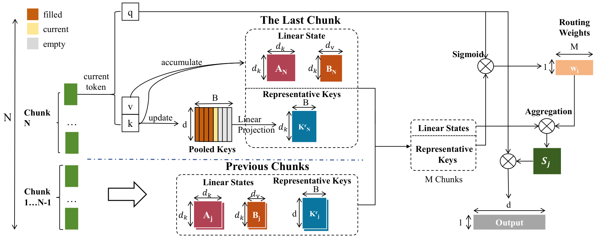

<h1 align="center">HLA</h1>
<p align="center"><b>Expressive Hybrid Linear Attention via Chunk-Wise Dynamic Mixing</b></p>
<p align="center">
  <a href="https://caesarhhh.github.io/hla/">Project Page</a> ·
  <a href="#quick-start">Quick Start</a> ·
  <a href="#models">Models</a> ·
  <a href="#training">Training</a> ·
  <a href="../README.md">Overview</a>
</p>

HLA gives linear attention selective access to past context through learned routing over compact chunk summaries.

<p align="center">
  
</p>

## Quick Start

### 1. Install

Requires Linux, an NVIDIA CUDA GPU, and Python 3.11–3.13.

```bash
git clone https://github.com/Caesarhhh/HLA_.git
cd HLA_/hla-lm
PYTHON_BIN=python3.11 bash scripts/setup_env.sh
source .venv/bin/activate
```

### 2. Download

```bash
hf download Caesar216/HLA-1.3B-C256-P16-100B --local-dir checkpoints/hla-1.3b
```

### 3. Generate text

```bash
python generate.py \
  --checkpoint checkpoints/hla-1.3b/final-model-ckpt.pth \
  --tokenizer checkpoints/hla-1.3b \
  --prompt "The history of linear attention" \
  --max-new-tokens 128
```

The generated continuation is printed to the terminal. This is a pretrained base model with greedy decoding.

## Models

Both models have 1.3B parameters and are trained on 100B tokens with a 4K context window.

| Model | Setting | Download |
|:---|:---|:---|
| **HLA** | Chunk size 256, pool size 16 | [Hugging Face](https://huggingface.co/Caesar216/HLA-1.3B-C256-P16-100B) |
| GDN | Matched baseline | [Hugging Face](https://huggingface.co/Caesar216/GDN-1.3B-100B) |

`generate.py` loads the native HLA checkpoint; the GDN checkpoint is provided for baseline comparisons.

## Training

Pack raw SlimPajama JSONL shards using the released tokenizer:

```bash
python scripts/prepare_slimpajama.py \
  --source_path /path/to/SlimPajama \
  --tokenizer_path checkpoints/hla-1.3b \
  --destination_path data/slimpajama
```

The source directory should contain `train/chunk*/*` shards. For pre-tokenized Arrow data, use [pack_tokenized_arrow.py](scripts/pack_tokenized_arrow.py).

Launch the 1.3B / 100B-token recipe on the visible GPUs:

```bash
CUDA_VISIBLE_DEVICES=0,1 \
TRAIN_DATA="$PWD/data/slimpajama" \
OUTPUT_ROOT="$PWD/checkpoints/training" \
bash scripts/train_hla_1p3b_100b_from_scratch.sh
```

For GDN, use `scripts/train_gdn_1p3b_100b_from_scratch.sh`. Training resumes automatically from the rolling checkpoint; set `RUN_TAG` to start an independent run.

## Results

RULER macro averages; both models are trained at 4K context.

| Model | 4K | 8K | 16K | 32K |
|:---|---:|---:|---:|---:|
| GDN | 24.63 | 15.02 | 7.98 | 3.65 |
| **HLA** | **25.46** | **17.69** | **11.05** | **7.87** |

## Acknowledgements

Built on GatedDeltaNet, Flash Linear Attention, and Lit-GPT. See [LICENSE](LICENSE) and [source credits](docs/SOURCE.md).
