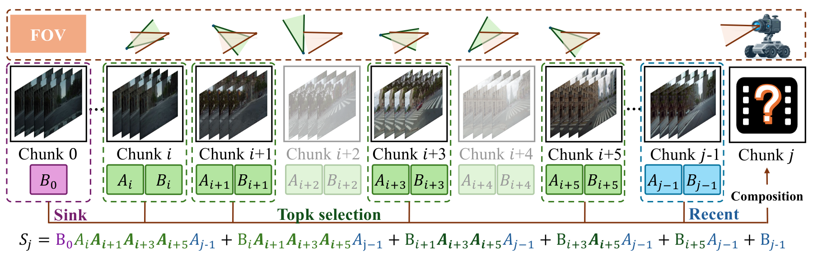

<h1 align="center">HLA-WM</h1>
<p align="center"><b>Hybrid Linear Attention for Long-Horizon Video World Models</b></p>
<p align="center">
  <a href="https://caesarhhh.github.io/hla-wm/">Project Page</a> ·
  <a href="#quick-start">Quick Start</a> ·
  <a href="#baseline-comparisons">Video Gallery</a> ·
  <a href="../README.md">HLA</a>
</p>

HLA-WM improves scene consistency in SANA-WM by retrieving relevant history from camera geometry. No additional training is required.

## Quick Start

### 1. Install

Requires Linux, an NVIDIA CUDA GPU, and Python 3.10–3.12. Use a separate environment from HLA-LM.

```bash
git clone https://github.com/Caesarhhh/HLA_.git
cd HLA_/hla-wm
PYTHON_BIN=python3.11 bash scripts/setup_env.sh
source .venv/bin/activate
```

### 2. Download

Download the model bundle and an [official SANA-WM example](https://github.com/NVlabs/Sana/tree/main/asset/sana_wm):

```bash
hf download Efficient-Large-Model/SANA-WM_streaming --local-dir checkpoints/streaming

mkdir -p examples
for file in demo_0.png demo_0.txt demo_0_pose.npy demo_0_intrinsics.npy; do
  curl -fL "https://raw.githubusercontent.com/NVlabs/Sana/main/asset/sana_wm/$file" -o "examples/$file"
done
```

The [Stage-1 text encoder](https://huggingface.co/Efficient-Large-Model/gemma-2-2b-it) downloads automatically on first use.

### 3. Generate a video

```bash
python infer.py --mode stage1 \
  --image examples/demo_0.png --prompt examples/demo_0.txt \
  --camera examples/demo_0_pose.npy --intrinsics examples/demo_0_intrinsics.npy \
  --streaming_root checkpoints/streaming \
  --output_dir outputs/demo --name hla_wm --num_frames 241 \
  --offload_text_encoder --offload_vae --offload_refiner
```

The video is saved to `outputs/demo/hla_wm_generated.mp4`.

| Option | Usage |
|:---|:---|
| AR refinement | Replace `--mode stage1` with `--mode ar` |
| Bidirectional refinement | Replace `--mode stage1` with `--mode bi` |
| SANA-WM baseline | Add `--baseline` |

Both refinement modes use the AR refiner in the downloaded bundle. For your own scene, replace the four example paths; set `--median-depth` to its representative depth in camera translation units when available (default: `3.0`).

## Results

Stage 1 on the Hard-Trajectory split of SANA-WM-Bench.

| Method | PSNR ↑ | SSIM ↑ | FPS ↑ |
|:---|---:|---:|---:|
| SANA-WM | 9.37 | 0.1774 | **22.403** |
| **HLA-WM** | **10.11** | **0.1997** | 22.053 |

## Baseline comparisons


**Left: SANA-WM · Right: HLA-WM.** Click a preview for the full video. [More examples →](https://caesarhhh.github.io/hla-wm/#videos)

### Stage 1

**game_style_002 · Hard-Trajectory**

[](docs/comparisons/stage1_hard80_game_style_002_f92_f824.mp4)

### AR refinement

This example uses full-sequence autoregressive refinement.

**indoor_018 · Hard-Trajectory**

[](docs/comparisons/ar_refiner_hard80_indoor_018_f76_f852.mp4)

### Bidirectional refinement

**game_style_011 · Hard-Trajectory**

[](docs/comparisons/official_bidirectional_refiner_hard80_game_style_011_f400_f776.mp4)

## Method



Camera geometry selects relevant past chunks, whose summaries are composed into recurrent memory for generation.

## Acknowledgements

Built on [SANA-WM / SANA](https://github.com/NVlabs/Sana). See [LICENSE](LICENSE) and [source credits](docs/SOURCE.md).
